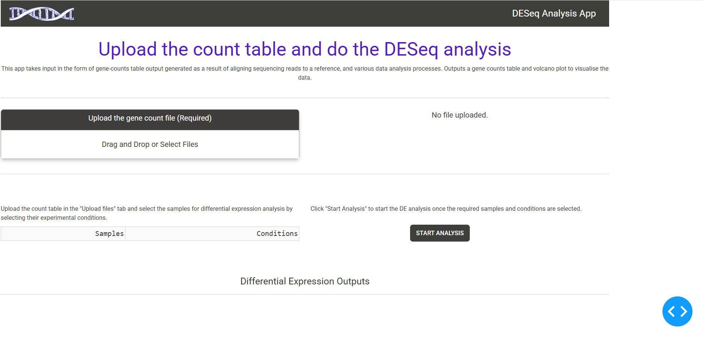

# bioinformatics_project

# Differential Expression Analysis Web-app

The purpose of this mini web application is to do differential expression analysis between genes using DESeq2, from a gene count file. It generates;
- A differential expression output file in CSV format
- An interactive volcano plot for data visualization 

## How to run the app
Here is a step by step of how to run the webapp on a unix (bash) terminal.
1. Pull the app folder from git hub : 
    * Ensure git is enabled. Check using:
        ''' bash
        git --version
        '''
    * Clone the repository: 
        git clone https://github.com/arunjoseph-bioinfo/bioinformatics_project.git
    * Navigate to the project directory: 
        cd bioinformatics_project/mini_app
2. Install required dependencies using conda environment file 
    * Ensure conda is intalled (I am using miniconda : https://www.anaconda.com/docs/getting-started/miniconda/install#linux)
    * Install the dependencies using the environment file: 
        conda env create -f environment.yml
    * Once installed, activate the environment using conda: 
        conda activate mini-app-env
3. Installing DESeq2 on R (skip if already installed):
    * Ensure that R is installed on your bash system. Check using:
        R --version
    * Launch R by typing R on the commandline
    * In the R console:
        if (!requireNamespace("BiocManager", quietly = TRUE))
            install.packages("BiocManager")

        BiocManager::install("DESeq2")
    * If promt ask you to select server, select the appropriate server.
4. Once everything is successful, run the web app:
    * On the bash commandline, run the app:
        'python app.py'
    * In the pop-up, open the app on browser, or open the following link on your computer. 
        http://127.0.0.1:6688/
5. The app should be running now.

## How to interact with the app
1. In the app, click on the 'Drag and Drop or Select Files' box inside the 'Upload the gene count file' box.
    * The app expects gene count tables with column one being gene names and following columns represent the samples. If your format is any different, it may not work.
    * The gene counts must be integers. If the file contains decimals, the app will not work (DESeq2 expects counts. If normalised (e.g., using log or TPM), make them into whole numbers before running the app)
    * Uploading any files other than '.csv' or '.xlsx' will raise an error.
2. Once the file is properly uploaded, you will see the sample names in one column and condition in another column. It contains a dropdown option, which lets you choose controls and treatments. 
    * Select atleast one control and two treatments for comparison.
    * Only the selected samples will be compared in the differential expression analysis.
3. It might take a few seconds for the DE analysis to run. Once done, it will generate an output table, which can be studied.
    * You can filter the data on the first row of the anlaysis table
    * You can download the output data using the button.
4. The app also produces a volcano plot to visualise the output data.
    * You can adjust the effect sizes slider to adjust effect sizes on the output.
    * Hover over the dots to get information about the samples and its values.
    * You can download the plot using the camera icon above the plot.
5. Once done, close the app from the terminal by pressing Ctrl+C.

